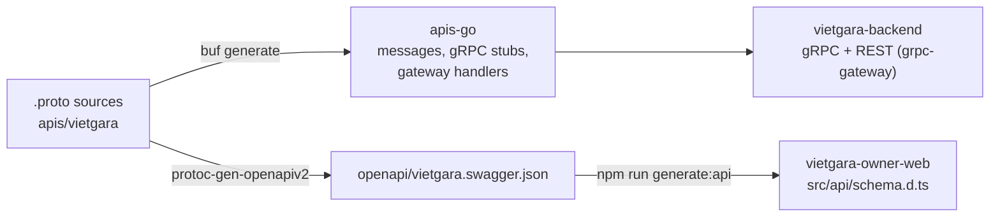

# VietGara Proto

> **Purpose:** This repo is the **source of truth for the VietGara API contracts**: Protocol Buffers definitions plus the generated Go, gateway and OpenAPI code. It contains no running service.

| | |
| --- | --- |
| **Type** | Contract library (Protocol Buffers, generated code) |
| **Used by** | `vietgara-backend` (Go module), the web apps and e2e (TypeScript types from the OpenAPI document), the mobile apps (hand-written clients aligned to it) |
| **Does** | Defines every gRPC service and REST route, and generates the OpenAPI document and Go stubs |
| **Built with** | Protocol Buffers, buf, grpc-gateway, protoc-gen-openapiv2 |
| **Checked by** | Lint, format and breaking-change detection in CI |
| **Related** | `vietgara-docs` (API Specification) |

Source-of-truth repository for the **VietGara API contracts**, defined with
Protocol Buffers. The same `.proto` files describe:

- the **gRPC** services the backend implements (ADR-006), and
- the **REST/JSON API** served through the API Gateway: every RPC carries a
  `google.api.http` annotation, the backend serves it in-process with
  [grpc-gateway](https://github.com/grpc-ecosystem/grpc-gateway), and the
  OpenAPI document generated here (`openapi/vietgara.swagger.json`) is the
  source of the owner web's TypeScript types. Go code can import it as
  `openapi.Spec` (package `github.com/viettechno/vietgara-proto/openapi`);
  the backend serves it with its API reference page.

## Roles / Purposes

- **Define the API contracts** of the VietGara modules as `.proto` files,
  versioned per module (`vietgara.<module>.v1`).
- **Generate code**: Go messages and gRPC stubs, grpc-gateway handlers
  (`apis-go/`), and one merged OpenAPI v2 document (`openapi/`). Generated
  code is committed so consumers need no protobuf toolchain.
- **Enforce quality**: `buf lint`, `buf format`, `buf breaking`, and a CI
  check that the generated code matches the sources.

## API conventions

| Rule | Convention |
| --- | --- |
| Resources | Plural nouns under `/api/v1`; garage data under `/api/v1/garages/{garage_id}/…`; the caller's own data under `/api/v1/me/…` |
| Methods | `Get`/`List` → GET, `Create` → POST (201), `Update` → PATCH with the resource as the body and an optional `update_mask` (filled from the JSON keys when omitted), `Delete` → DELETE (204) |
| Actions | Custom verbs as sub-resources: `…/invitations/{id}/accept`, `/me/subscription/plan-changes`, `/admin/subscriptions/{id}/extensions` |
| Lists | `repeated … data` plus `vietgara.common.v1.Pagination` (`page`, `page_size`, `total`) for paged lists |
| Enums | `<ENUM>_UNSPECIFIED = 0`; JSON uses the value names |
| Fields | `google.api.field_behavior` marks `REQUIRED` and `OUTPUT_ONLY` fields |
| Errors | `vietgara.common.v1.ErrorResponse`: `{"error": {"code", "message", "details"}}`; `code` is a stable reason such as `PLAN_LIMIT_REACHED` |
| Security | Bearer JWT on every RPC except sign-in, sign-up and password reset |

## Modules

| Proto package | Module | Services |
| --- | --- | --- |
| `vietgara.identity.v1` | Identity & Access (HLD #1) | `AuthService`: Register, Login, RefreshToken, Logout, SendEmailVerificationOtp, VerifyEmail, RequestPasswordReset, VerifyPasswordResetOtp, ResetPassword |
| | | `UserService`: GetMe, UpdateMe |
| `vietgara.tenant.v1` | Tenant/Garage (HLD #2) | `GarageService`: ListGarages, CreateGarage, GetGarage, UpdateGarage, UploadGarageLogo, DeleteGarageLogo |
| | | `StaffService`: ListStaff, UpdateStaff, DeleteStaff, LookupStaffCandidate |
| | | `InvitationService`: CreateInvitation, ListInvitations, RevokeInvitation, ListMyInvitations, GetMyInvitation, AcceptInvitation, DeclineInvitation |
| | | `RoleService`: ListPermissions, ListRoles, GetRole, CreateRole, UpdateRole, DeleteRole |
| | | `StaffGroupService`: ListStaffGroups, CreateStaffGroup, UpdateStaffGroup, DeleteStaffGroup |
| `vietgara.license.v1` | License (HLD #3) | `LicenseService`: ListPlans, GetMySubscription, ChangeMyPlan, GetGarageEntitlements |
| | | `LicenseAdminService`: ListAllPlans, CreatePlan, UpdatePlan, ListSubscriptions, ExtendSubscription |
| `vietgara.customer.v1` | Customer & Vehicle (HLD #4) | `CustomerService`, `VehicleService`, `PartnerService`: List, Create, Get, Update, Delete (`PartnerService` becomes `SupplierService` in Release 5.0: suppliers only, no insurer type) |
| `vietgara.common.v1` | Shared messages | `Pagination`, `ErrorResponse` and the OpenAPI document options (no services) |



## Planned contract changes

Per the [Release Plan](https://github.com/viettechno/vietgara-docs/blob/master/docs/01-Product/Release_Plan/Release_Plan_Phase3.md) in `vietgara-docs` (API Specification, Section 16). Breaking changes are accepted deliberately while the product is in development (no real tenant yet); each one is a single, announced change.

| When | Change |
| --- | --- |
| Phase 3 | `Account` becomes `User`; `account_id` becomes `user_id`; the session carries `user`; no dual field and no compatibility window (`buf breaking` is expected to fail once) |
| Release 5.0 | Insurer fields of settlements and payments are removed and marked `reserved`; `PartnerService` becomes `SupplierService`; payment voucher fields; file registry messages; legal profile fields; `DELETED` / `DEACTIVATED` outcome on deletes |
| Release 5.1 | Customer user links and tax profiles |
| Releases 6.0, 6.1 | Units, part categories, MFA challenge and enrolment |
| Phase 7 | Platform roles, groups and invitations; support grants |
| Phases 8, 10 | Goods receipts, stock counts, adjustments, barcodes, imports; jobs, print settings |
| Phases 11-15 | Device tokens and push, sync for the technician BFF; booking; receivables, purchase orders; printers and templates; transfers |
| Phases 16-17 | Payments and e-invoices; insurers and claims; supplier portal |

## Repository Layout

```
vietgara-proto/
├── apis/vietgara/           # .proto sources (the contract)
│   ├── common/v1/            # pagination.proto, error.proto (+ OpenAPI options)
│   ├── identity/v1/          # user.proto, auth.proto
│   ├── tenant/v1/            # garage.proto, staff.proto, invitation.proto, access.proto
│   ├── license/v1/           # license.proto
│   └── customer/v1/          # customer.proto, vehicle.proto, partner.proto
├── apis-go/                  # generated Go code (committed)
├── openapi/                  # generated OpenAPI v2 document (committed) + embed.go (openapi.Spec)
├── buf.yaml                  # module, deps (googleapis, grpc-gateway), lint/breaking config
├── buf.gen.yaml              # plugins: go, go-grpc, grpc-gateway, openapiv2
├── go.mod                    # module github.com/viettechno/vietgara-proto
├── Makefile
├── make/                     # tools.mk (installers), proto.mk (tasks)
└── .github/workflows/ci.yml  # lint, format, generated-code and breaking checks
```

## Prerequisites

- Go 1.26+ (installs the pinned codegen tools)
- `$GOBIN` (or `$GOPATH/bin`) on your `PATH` so `buf` can find the plugins

## Common Commands

```sh
make install-codegen-tools  # buf, protoc-gen-go, protoc-gen-go-grpc,
                            # protoc-gen-grpc-gateway, protoc-gen-openapiv2
make install-tools          # the above plus grpcui and grpcurl
make generate               # regenerate apis-go/ and openapi/
make generate-check         # fail when committed generated code is stale
make lint                   # buf lint
make format                 # format proto files in place
make format-check           # fail if any proto file is not formatted
make breaking               # detect breaking changes vs master
make verify                 # lint + format-check + generate + go build ./...
make clean                  # remove apis-go/
make help                   # list all targets
```

Tool versions are pinned in `make/tools.mk` (buf `1.72.0`, protoc-gen-go
`v1.36.11`, protoc-gen-go-grpc `v1.6.2`, grpc-gateway plugins `v2.30.0`,
grpcui `v1.5.3`, grpcurl `v1.8.7`).

## Continuous Integration

`.github/workflows/ci.yml` runs on pushes and pull requests to `master`:

- **verify**: `buf lint`, `buf format --diff --exit-code`,
  `make generate-check` and `go build ./...`;
- **breaking** (pull requests): `buf breaking` against the base branch. A
  deliberate breaking change (for example a contract not released yet) is
  acknowledged with the `breaking-change` pull-request label.

## Contributing a Change

1. Edit the `.proto` sources under `apis/vietgara/...`; give each new RPC an
   `google.api.http` rule following the conventions above.
2. `make format` then `make lint`.
3. `make generate` and commit `apis-go/` and `openapi/` together with the
   `.proto` change (they must never drift).
4. Regenerate the owner web types (`npm run generate:api` in
   `vietgara-owner-web`) and bump the module in `vietgara-backend`.
5. Run `make breaking`; label the pull request `breaking-change` only when the
   break is intended.

## Consuming from a Go Service

Add the module as a dependency, e.g. in `vietgara-backend`:

```sh
go get github.com/viettechno/vietgara-proto@master
```

```go
import (
    identityv1 "github.com/viettechno/vietgara-proto/apis-go/vietgara/identity/v1"
    tenantv1 "github.com/viettechno/vietgara-proto/apis-go/vietgara/tenant/v1"
    customerv1 "github.com/viettechno/vietgara-proto/apis-go/vietgara/customer/v1"
)
```

## Testing with grpcui

[grpcui](https://github.com/fullstorydev/grpcui) is an interactive web UI
for calling gRPC services. It discovers the exposed services through the
server reflection API, so **the target server must have gRPC reflection
registered** (`google.golang.org/grpc/reflection`). If it is not, grpcui
exits with:

```sh
Failed to compute set of methods to expose: server does not support the reflection API
```

That error means the server is reachable but reflection is missing — enable
it in the server that owns the gRPC listener. For `vietgara-backend`
(`vietgara-backend/cmd/server/main.go`), register it right after
`grpc.NewServer(...)`:

```go
import "google.golang.org/grpc/reflection"

reflection.Register(grpcServer)
```

You can verify reflection works before opening grpcui with `grpcurl`:

```sh
grpcurl -plaintext localhost:50051 list
```

Install (pinned):

```sh
make install-grpcui
```

### Examples

Connect to a local server running without TLS, using the default web port
(8080) — the browser opens automatically:

```sh
grpcui -plaintext localhost:50051
```

Choose a different port for the web UI and disable auto-open:

```sh
grpcui -plaintext -port 9000 -open-browser=false localhost:50051
```

Send authenticated calls with the Bearer token the API returns (garage-scoped
RPCs take the garage from their `garage_id` field):

```sh
grpcui -plaintext \
  -H 'authorization: Bearer <access-token>' \
  localhost:50051
```

Connect to a TLS-secured server (prod/staging, certificate issued for the
server name in the address):

```sh
grpcui myhost:443
```

With a self-signed certificate:

```sh
grpcui -cacert ca.crt -servername myhost myhost:443
```

> Tip: `-H` headers are injected into every request made from the UI.
> You can also add per-request metadata directly in the UI form.
